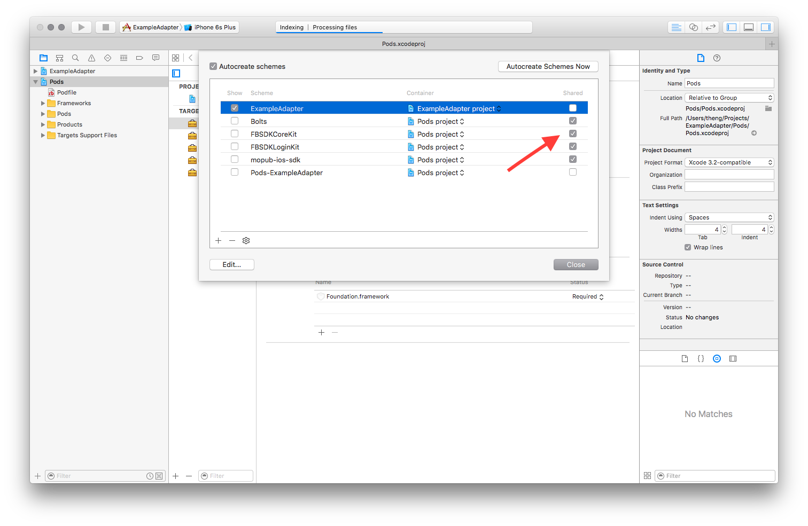

# Example Adapter #
Because cocoapods can get its grubby scripts off my .xcodeproj

This is an example of how to create your own cocoapod adapter project to house external dependencies that refuse to support Carthage. 

1. Create a single view or empty project.
2. Create your podfile with use_frameworks! and include any pods that don't currently support Carthage.
3. Run `pod install`
4. Open up the generated workspace and choose `Manage Schemes`
5. Cocoapods should have created schemes for each of your dependencies. To make this visible to Carthage we want to share them. 
6. Add this dependency repo to your carthage dependencies after committing and pushing to github. ie. to add this repo use `github "tucali/ExampleAdapter" "master"`